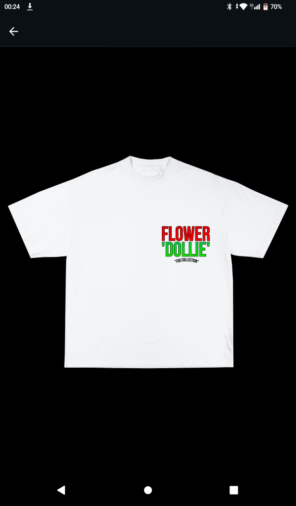

# SQL Database for a Clothing Brand

## Background and Overview:

FOG Clothing Brand, a local fashion label, had been tracking its sales data manually, without recording vital details like dates. The data, stored in a text file, lacked structure, making it difficult to analyse trends or draw insights. To support the brand’s growth, I volunteered to design and implement a relational database to better manage their sales data and improve decision-making.

This project involves the creation of a comprehensive SQL database for FOG Clothing Brand. The database includes key entities such as customers, products, collections, and sales. By organising this data into structured tables, the project enables efficient storage, retrieval, and management of sales information. The database also supports future analytical capabilities, such as sales trend visualisation and customer behaviour analysis.

## Data Structure:

- Customers: Stores customer details like names and locations.

- Products: Contains product information including name and price.

- Collections: Includes different clothing collections offered by FOG.

- Sales: Records sales transactions, linking customers, products, and collections.

This database lays the foundation for enhanced business intelligence, empowering the brand to track performance and make data-driven decisions.

## Executive Summary:

This project demonstrates the application of SQL database design to streamline and organize business data for improved management and analysis. I created a structured database to enhance data accessibility and ensure consistency, with properly defined relationships between customers, products, collections, and sales. This provides a scalable foundation for further business insights and reporting, enabling efficient data-driven decisions for FOG Clothing. Through this database, the brand can easily manage its data and set the groundwork for future expansion into advanced analytics and business intelligence.

